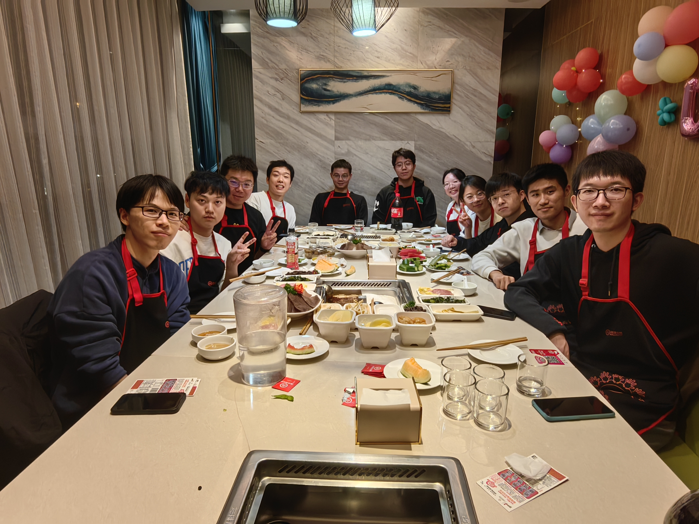

---
title: People
date: 2024-10-24

type: landing

sections:
  - block: people
    content:
      title: Meet the Team
      # Choose which groups/teams of users to display.
      #   Edit `user_groups` in each user's profile to add them to one or more of these groups.
      user_groups:
          - Principal Investigators
          - Postdocs
          - PhD Students
          - Masters Students
          - Undergraduate Students
          - Administration
          - Visitors
          - Alumni
          
      sort_by: Params.last_name
      sort_ascending: true
    design:
      show_interests: false
      show_role: true
      show_social: true

  - block: markdown
    content:
      title: Photo Gallery
      subtitle: Snapshots of Togetherness — Our Team Story
      text: |
            

          

              
              
20xx团建

          

          

              
              
xxxxx

          

          

              
              
xxxxxx

          

      

    design:
      columns: '1'
      view: card
      # For the Showcase view, do you want to flip alternate rows?
      flip_alt_rows: true

---