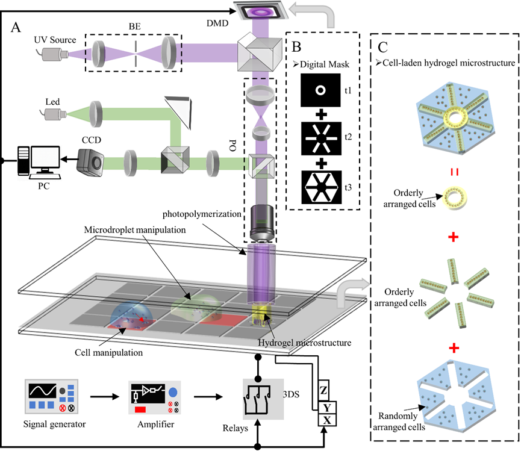
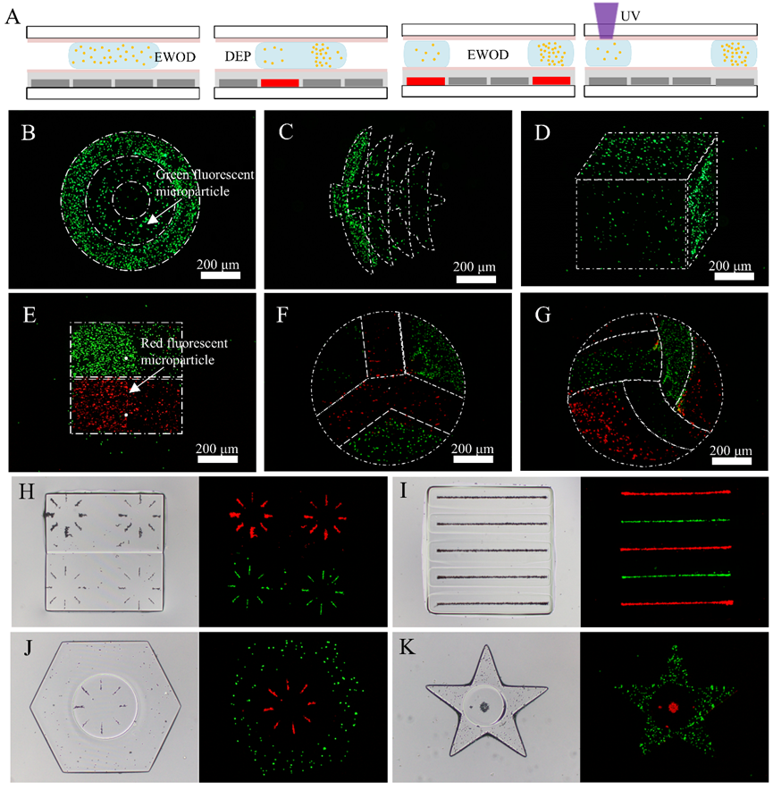

Integrated Cross-Scale Manipulation and Modulable Encapsulation of Cell-Laden Hydrogel for Constructing Tissue-Mimicking Microstructures

<!--more-->

北京理工大学研究团队报道了一种基于载细胞水凝胶液体跨尺度操作和调制封装的仿生微模块构建新方法。该方法通过毫-微尺度介电驱动实现了水凝胶液滴批量化片上运载及单一液滴内细胞群精准操作，结合数字光交联固化技术实现具有细胞群特定空间分布的水凝胶液滴图案化可控封装，构建定制化仿生微模块，突破了对细观尺度下真实生物组织形貌、机械特性和细胞分布方式的高度还原。该成果以题为“Integrated Cross-Scale Manipulation and Modulable Encapsulation of Cell-Laden Hydrogel for Constructing Tissue-Mimicking Microstructures”发表于Research上。(Reseach, 2024, DOI: 10.34133/research.0414)

在生物体内，组织和器官由多种细胞及细胞外基质按特定的生物学规律排列形成，呈现出不同的时空分布特征，进而表达出多样化的生理功能。具体来说，不同类型的细胞排列成特定形状，并嵌入相应的细胞外基质中，形成生物组织模块，从而参与组织和器官的构建与生理活动。从微观尺度来看，细胞外基质的成分、机械特性、形貌，以及细胞间的相互作用，会直接影响细胞的行为特性，并对生物组织模块的功能表达起到关键的调节作用。然而，受现有生物制造技术限制，仿生微模块构建方法大多局限于使用生物墨水对活体细胞的直接封装，形成均质化微模块，被封装的细胞在其中随机分布。因此，如何在体外从宏尺度到微尺度高度模拟真实生物组织的结构特性和功能表达，从而构建具有定制化复合形貌、机械特性和细胞分布方式的仿生微模块，仍是急需解决的难题。

研究团队首先搭建了仿生微模块片上复合生物打印系统，该系统包括：电场力驱动数字微流控子系统和数字光交联固化打印子系统。

数字微流控子系统通过改变液滴两侧的亲疏水特性和产生非均匀电场提供驱动力，从而操作毫米级水凝胶液滴和微米级细胞，实现液滴的生成、运输、分裂、融合以及细胞的密度调控和排列。数字光交联固化打印子系统通过动态调控数字微镜阵列，控制紫外光图案对光敏水凝胶液滴进行可控光聚合，构建仿生微模块。其次，研究团队对数字微流控芯片的水凝胶液滴和细胞的操作性能进行了仿真分析，进而获得最优操作性能参数并进行实验验证。数字光交联固化打印子系统通过对数字微流控芯片上的水凝胶液滴进行光聚合来构建微模块，建立曝光时间与GelMA和PEGDA水凝胶微模块机械硬度之间的映射关系，并验证了复合生物打印系统的精度。

研究团队进一步通过介电泳对细胞群进行区域化聚集，以及液滴的分裂与聚合实现细胞群密度调控。调整密度后的水凝胶液滴通过紫外光聚合，封装为具有不同细胞密度的水凝胶微结构。利用数字光处理，能够进一步控制水凝胶微结构的形状和细胞分布，构建出具有细胞密度梯度分布的水凝胶微模块。为了形成特定的细胞图案，研究团队通过湿刻构建具有特定形状的电极，利用介电泳实现了细胞群的图案化聚集。介电润湿与介电泳的创新协同操作实现了水凝胶液滴内细胞密度、排列方式的有效调控，进而通过光固化交联构建了整体形貌、局部细胞分布、细胞群形态均可控的水凝胶微模块（图3）。总之，该系统展示了在非接触式调整细胞密度以及构建具有不同形貌、机械特性和细胞分布方式的复合水凝胶微模块的多功能性。

最后，研究团队对仿生微模块的细胞活性和生物功能进行了评估。通过对仿生微模块进行为期15天的培养并进行死活染色检测，实验结果表明，细胞在微模块中快速增殖并维持较高的细胞活性。为了验证微模块的生物功能，研究团队设计并构建了两种仿肝小叶模型，并对其分泌物尿素进行检测。结果表明，两种肝小叶模型的尿素分泌在培养期间一直具有一定的差异。

该研究表明，通过跨尺度操控毫米级水凝胶液滴和微米级细胞，并结合可调控的封装技术，能够构建高仿生微模块。这些仿生微模块能够高度复现生物组织和器官的各种微尺度结构和生理特征，从而在体外环境下表达与真实组织相似的特异性生物功能，有望应用于临床医疗中病变组织和器官的修复与替换，同时可替代活体动物模型，成为药物研发测试评估的理想模型。