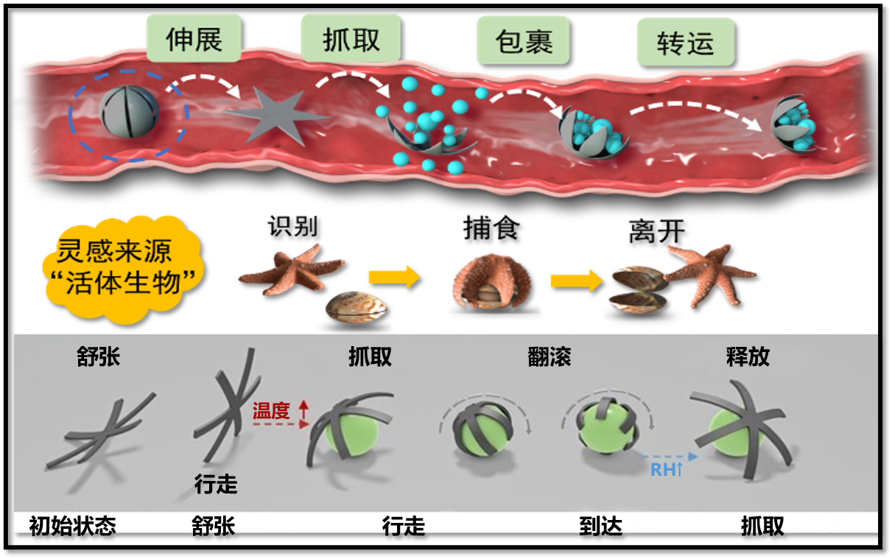

磁驱微机器人系统

<!--more-->

微机器人指尺度在毫-微-纳米级小型机器人，该类机器人能够基于物理场驱动在封闭人体环境执行任务，有望成为颠覆性新兴医疗器械。针对现有微机器人运动效率低、感知能力弱、运动控制难的问题，本项目提出自主形变仿生微机器人本体创成技术，首创环境感知多形变单元一体化集成微机器人；提出微机器人跨域多模态运动控制方法，大幅提升封闭非结构环境下微机器人适应性与作业能力。

