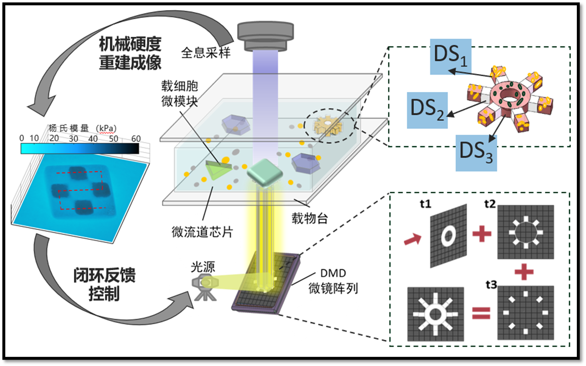
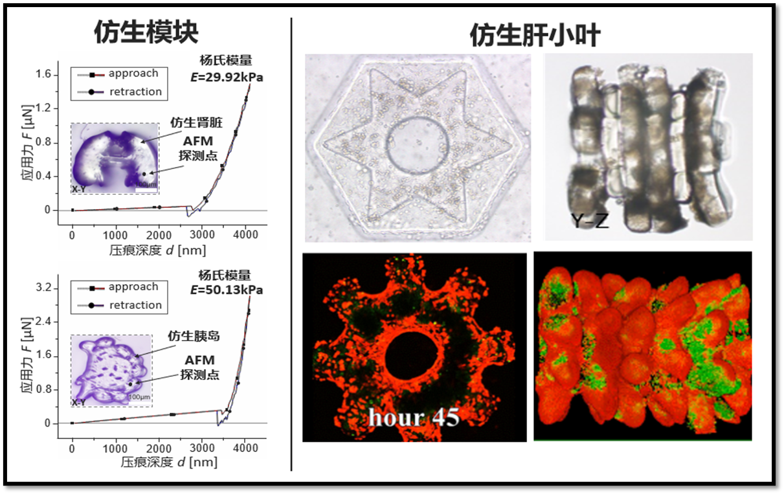
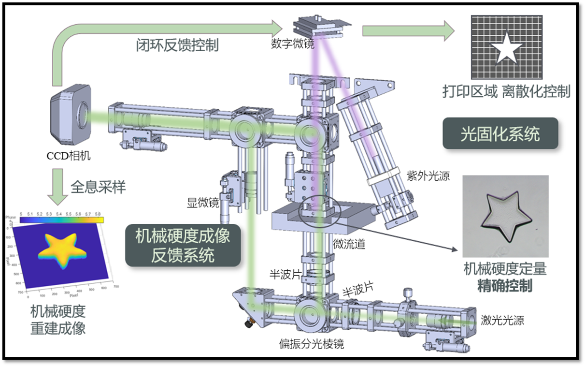

To reduce long development cycles and high costs in anti-tumor drug research, this organoid 4D printing system combines digital holographic microscopy with DMD-based light-curing microfabrication. Real-time holographic feedback enables precise control of structural stiffness as the fourth dimension, creating opportunities for drug screening, personalized therapeutic design, and rapid biofabrication.

  
  
  

